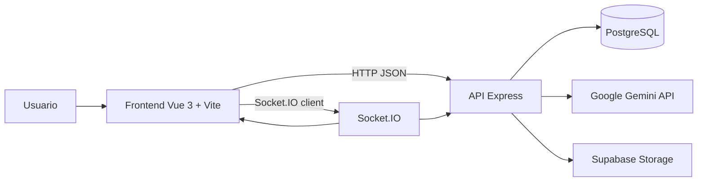
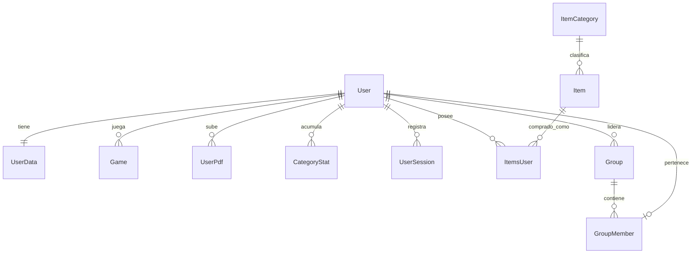
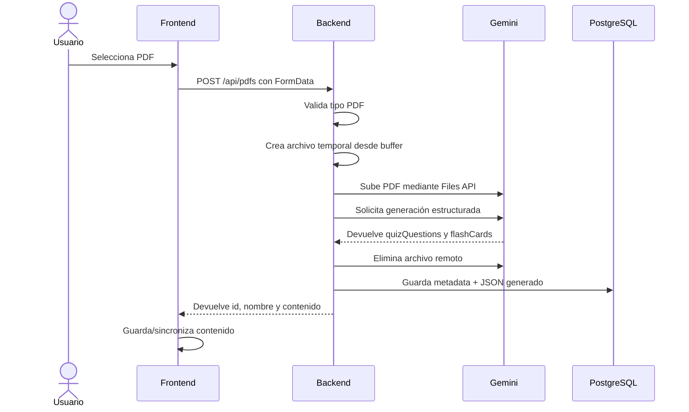
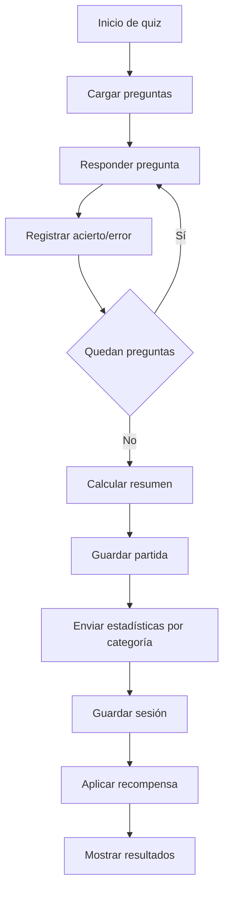
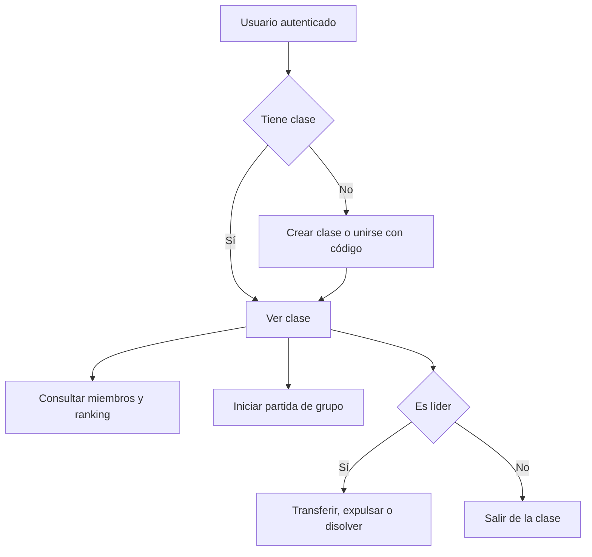

# Memoria del proyecto: LudoScript

> Documento base para pasar a Word.  
> Proyecto: LudoScript  
> Ciclo: Desarrollo de Aplicaciones Web  
> Autores: Miguel Ángel Laurero Zamora y Álvaro Pastor Periago  
> Tutor/a: [Completar]  
> Centro: Instituto Superior de Formación Profesional  
> Curso: [Completar]  
> Fecha: Junio de 2026

## Portada

**INSTITUTO SUPERIOR DE FORMACIÓN PROFESIONAL**

**PROYECTO FINAL DE CICLO**

**Ciclo Superior de Formación Profesional en Desarrollo de Aplicaciones Web**

**Proyecto LudoScript**

Autores:

- Miguel Ángel Laurero Zamora.
- Álvaro Pastor Periago.

Murcia, junio de 2026.

## Agradecimientos

En primer lugar, expresamos nuestro agradecimiento a los profesores que han guiado el desarrollo de este trabajo, por su orientación, paciencia y comentarios durante el proceso de construcción del proyecto.

También agradecemos a nuestras familias su apoyo constante, su comprensión y el respaldo ofrecido durante esta etapa formativa.

Por último, agradecemos a los compañeros y amigos que han compartido jornadas de estudio, pruebas, revisión de ideas y resolución de problemas durante el desarrollo de LudoScript.

## Nota de uso

Este documento está redactado como borrador avanzado de memoria. La información técnica se ha obtenido del repositorio del proyecto y de la documentación existente. Los campos marcados como `[Completar]` deben revisarse antes de entregar la versión final, especialmente fechas oficiales, datos personales, capturas y valoración personal.

---

# 1. Introducción

## 1.1. Contexto del proyecto

LudoScript es una aplicación web educativa orientada al aprendizaje de JavaScript mediante actividades gamificadas. El sistema combina cuestionarios, flashcards, estadísticas de progreso, recompensas, personalización visual del perfil, generación de contenido a partir de documentos PDF y funcionalidades multijugador en tiempo real.

El proyecto se desarrolla en el contexto del Trabajo de Fin de Grado del ciclo de Desarrollo de Aplicaciones Web. La idea principal parte de una necesidad habitual en el aprendizaje de programación: muchos alumnos estudian teoría o consultan documentación, pero no siempre cuentan con una herramienta que convierta ese contenido en práctica guiada, medible y motivadora.

La aplicación se plantea como una plataforma en la que el alumno puede practicar conceptos de JavaScript, subir apuntes propios en PDF para generar preguntas mediante IA y consultar su progreso de forma visual. Además, incluye elementos de juego como monedas, rachas, tienda de objetos, avatar, recompensas diarias, clases, duelos y partidas multijugador.

## 1.2. Justificación de la idea

El aprendizaje de programación requiere práctica continuada, feedback inmediato y repetición. Sin embargo, muchas herramientas educativas se centran en lecciones lineales o ejercicios aislados. LudoScript busca reducir esa distancia entre teoría y práctica mediante un entorno que permita:

- Practicar conceptos de JavaScript con preguntas organizadas por categorías.
- Convertir apuntes propios en cuestionarios y flashcards usando IA.
- Mantener la motivación mediante recompensas, progresión y personalización.
- Consultar estadísticas para detectar fortalezas y debilidades.
- Aprender de forma individual o con otros usuarios mediante clases, duelos y salas.

La elección de JavaScript como contenido principal es coherente con el ciclo formativo, ya que es una tecnología base en el desarrollo web moderno y se utiliza tanto en frontend como en backend. Además, la generación automática de preguntas desde PDF permite adaptar la práctica a los materiales concretos del alumno o del profesor.

## 1.3. Objetivos del proyecto

El objetivo general del proyecto es desarrollar una aplicación web educativa y gamificada que facilite el aprendizaje y la práctica de JavaScript.

Objetivos específicos:

- Crear una SPA moderna con Vue 3, Vite, Pinia y Vue Router.
- Desarrollar una API REST con Node.js, Express y Sequelize.
- Persistir usuarios, progreso, estadísticas, partidas, tienda, grupos y contenido generado en una base de datos PostgreSQL.
- Implementar autenticación con JWT y control de acceso por roles.
- Incorporar generación de preguntas y flashcards desde PDF mediante Google Gemini.
- Añadir un sistema de dificultad adaptativa por categorías.
- Implementar actividades de quiz y flashcards.
- Registrar estadísticas de sesión y estadísticas acumuladas por categoría.
- Crear funcionalidades de gamificación: monedas, rachas, recompensas diarias, tienda y equipamiento visual.
- Incorporar grupos o clases para aprendizaje colectivo.
- Añadir partidas en tiempo real con Socket.IO, incluyendo duelos, salas multijugador y modo espectador.
- Crear un panel de administración para usuarios e ítems.
- Desarrollar pruebas automatizadas en el frontend para componentes y composables principales.

## 1.4. Alcance del sistema

El alcance del sistema incluye una aplicación web completa con frontend, backend, base de datos, tiempo real e integración con servicios externos.

Incluido en el alcance:

- Registro, login y sesión persistente mediante token JWT.
- Perfil de usuario con avatar, banner, progreso y estadísticas.
- Quiz con banco de preguntas predefinido.
- Modo de preguntas adaptativas según categorías débiles.
- Generación de contenido desde PDFs del usuario.
- Flashcards a partir de preguntas predefinidas o generadas.
- Recompensas por actividad y recompensa diaria.
- Tienda de objetos y equipamiento visual del perfil.
- Gestión de clases o grupos.
- Duelos, salas multijugador y vista pública de espectador.
- Panel de administración para usuarios e ítems.
- Persistencia en PostgreSQL mediante Sequelize.
- Uso de Supabase Storage para recursos de imagen cuando procede.

Fuera del alcance o limitado:

- No se desarrolla una aplicación móvil nativa.
- No se implementa un sistema completo de pagos.
- No se almacena el archivo PDF original en la base de datos; se guarda el contenido generado.
- La integración con IA depende de la disponibilidad de la API de Gemini y de la configuración de `GEMINI_API_KEY`.
- La suite de pruebas automatizadas se centra principalmente en frontend; el backend no dispone todavía de una suite equivalente completa.

## 1.5. Análisis del mercado existente

En el mercado actual existen diversas plataformas educativas que incorporan gamificación, seguimiento del progreso, cuestionarios o actividades interactivas. Sin embargo, muchas de ellas presentan limitaciones relacionadas con la personalización del aprendizaje, el análisis de debilidades del estudiante o la aplicación específica al aprendizaje de programación.

A continuación se analizan algunas de las herramientas más relevantes y su relación con la propuesta desarrollada.

### Wayground.com

Wayground es una plataforma orientada a productividad y estudio que combina técnicas de gamificación con seguimiento del tiempo y recompensas por completar tareas.

Ventajas:

- Diseño moderno y visualmente atractivo.
- Integración de sistemas de progreso y motivación.
- Uso de recompensas para incentivar la constancia.

Inconvenientes:

- No está centrada específicamente en el aprendizaje académico o técnico.
- Carece de actividades adaptativas orientadas a reforzar conocimientos concretos.
- Algunas funcionalidades avanzadas dependen de modelos de suscripción.

### Quizlet

Quizlet es una herramienta educativa basada principalmente en tarjetas de estudio y ejercicios de memorización interactiva. Es una de las plataformas más utilizadas por estudiantes para el repaso rápido de contenidos.

Ventajas:

- Amplia base de datos de materiales creados por la comunidad.
- Diferentes modos de estudio y actividades interactivas.
- Interfaz sencilla y accesible desde distintos dispositivos.

Inconvenientes:

- El aprendizaje está muy orientado a memorización y repetición.
- Tiene poca personalización adaptativa basada en rendimiento.
- Su análisis de errores y puntos débiles es limitado para contenidos de programación.

### Kahoot

Kahoot es una plataforma basada en cuestionarios interactivos y dinámicas competitivas en tiempo real, especialmente utilizada en entornos educativos grupales.

Ventajas:

- Alta capacidad de interacción y participación.
- Experiencia dinámica y motivadora.
- Facilidad de uso para docentes y alumnos.

Inconvenientes:

- Su enfoque se orienta principalmente a actividades grupales.
- Es menos útil para aprendizaje individual y progresivo.
- Sirve muy bien para repasar, pero no guía de forma profunda el aprendizaje posterior.

### Duolingo for Schools

Duolingo for Schools aplica mecánicas de gamificación al aprendizaje de idiomas mediante progresión por niveles, rachas y recompensas.

Ventajas:

- Sistema de gamificación muy desarrollado.
- Seguimiento continuo del progreso del estudiante.
- Experiencia optimizada para uso frecuente.

Inconvenientes:

- Su ámbito se limita al aprendizaje de idiomas.
- Ofrece poca flexibilidad para adaptar contenidos personalizados.
- El aprendizaje se basa en rutas relativamente cerradas.

### Comparativa general

| Herramienta | Enfoque principal | Diferencias respecto a LudoScript |
| --- | --- | --- |
| Wayground | Productividad y hábitos de estudio | LudoScript se centra en aprendizaje de programación, preguntas, flashcards y seguimiento técnico. |
| Codecademy | Cursos interactivos guiados | LudoScript se centra en práctica gamificada, estadísticas propias y contenido desde PDF. |
| freeCodeCamp | Currículo abierto con ejercicios | LudoScript es más ligero, personalizado y centrado en quizzes, flashcards y progreso por usuario. |
| Kahoot | Cuestionarios competitivos | LudoScript añade perfil, IA, dificultad adaptativa, tienda, clases y persistencia individual. |
| Quizizz | Evaluaciones y quizzes | LudoScript se orienta específicamente a programación y aprendizaje de JavaScript. |
| Duolingo | Gamificación educativa | LudoScript toma elementos de racha y recompensa, pero aplicados al aprendizaje técnico. |
| Quizlet | Tarjetas y memorización | LudoScript combina flashcards con evaluación, IA, métricas y actividades en tiempo real. |

La propuesta diferencial de LudoScript es combinar aprendizaje de JavaScript, generación de contenido desde apuntes, adaptación por rendimiento, gamificación y colaboración en una misma aplicación.

## 1.6. Propuesta de solución

La solución propuesta consiste en una plataforma web dividida en dos grandes partes:

- Frontend: aplicación Vue 3 que ofrece la interfaz de usuario, navegación, actividades, perfil, tienda, clases y juegos.
- Backend: API Node.js/Express que centraliza la autenticación, reglas de negocio, persistencia, integración con IA y comunicación en tiempo real.

El sistema se apoya en una base de datos PostgreSQL gestionada mediante Sequelize. Para las funcionalidades en tiempo real utiliza Socket.IO. Para la generación de preguntas y flashcards desde PDF utiliza Google Gemini, procesando el archivo en memoria y guardando únicamente el JSON generado.

---

# 2. Planificación del proyecto

## 2.1. Metodología de trabajo utilizada

La metodología utilizada ha sido incremental e iterativa. El proyecto se ha desarrollado por bloques funcionales, incorporando mejoras y corrigiendo problemas según se detectaban durante la implementación.

Este enfoque resulta adecuado para un proyecto con varias áreas diferenciadas:

- Autenticación y perfil.
- Actividades educativas.
- Generación de contenido mediante IA.
- Estadísticas y dificultad adaptativa.
- Gamificación.
- Multijugador y clases.
- Administración.
- Pruebas y documentación.

El trabajo se ha organizado en ciclos cortos: análisis de una funcionalidad, implementación, prueba manual, corrección, documentación técnica y paso al siguiente bloque. La documentación existente del repositorio refleja esta evolución con entradas fechadas entre abril y mayo de 2026.

## 2.2. Planificación inicial

La planificación inicial estimada se puede organizar en las siguientes fases:

| Fase | Periodo estimado | Trabajo previsto |
| --- | --- | --- |
| 1. Análisis y diseño inicial | Semana 1 | Definición de idea, usuarios, alcance, tecnologías y estructura base. |
| 2. Base técnica | Semanas 2-3 | Creación de frontend Vue, backend Express, conexión con base de datos y autenticación. |
| 3. Funcionalidades educativas | Semanas 4-5 | Quiz, banco de preguntas, categorías, flashcards y área de aprendizaje. |
| 4. IA y PDFs | Semanas 6-7 | Subida de PDF, integración con Gemini y persistencia de preguntas generadas. |
| 5. Gamificación | Semanas 8-9 | Monedas, recompensas, rachas, tienda y personalización del usuario. |
| 6. Funciones sociales | Semanas 10-11 | Clases, grupos, multijugador, duelos y espectadores. |
| 7. Administración y pruebas | Semana 12 | Panel admin, pruebas automatizadas y correcciones. |
| 8. Documentación y memoria | Semana 13 | Redacción de memoria, capturas, anexos y revisión final. |

## 2.3. Planificación final

La planificación real evolucionó durante el desarrollo. Según la documentación del repositorio, algunas fechas destacadas fueron:

| Fecha | Hito desarrollado |
| --- | --- |
| 07/04/2026 | Sistema de quiz adaptativo con IA y separación entre quiz adaptativo y PDF con almacenamiento local. |
| 08/04/2026 | Mejoras de UX en el panel de inicio y correcciones de errores en la carga de quizzes con PDF. |
| 13/04/2026 | Juego de flashcards con tracking y botones de acierto/error. |
| 15/04/2026 | Sistema de clases y grupos. |
| 16/04/2026 | Partida de grupo y espectadores sin cuenta. Rediseño del banco de preguntas por dificultad. |
| 21/04/2026 | Estadísticas de sesión en la nube. |
| Mayo 2026 | Consolidación de documentación, paneles, pruebas, ajustes de interfaz y preparación de memoria. |

## 2.4. Comparación entre planificación inicial y final

La planificación inicial preveía una aplicación educativa con gamificación y práctica de JavaScript. La planificación final amplió el alcance en varios puntos:

- Se añadió generación de contenido desde PDF mediante Gemini.
- Se incorporó una estrategia de persistencia dual: nube y `localStorage` con claves por usuario.
- Se añadió un sistema de dificultad adaptativa por categoría.
- Se amplió la parte social con clases, duelos, salas y espectadores.
- Se desarrolló un panel de administración más completo para usuarios e ítems.
- Se añadieron pruebas unitarias en composables y componentes críticos.

También se detectaron ajustes pendientes en la fase final, especialmente en la suite de pruebas, donde la ejecución actual muestra fallos que deben corregirse antes de considerar la validación automatizada como completamente estable.

## 2.5. Justificación de cambios durante el desarrollo

Los cambios se justifican por la evolución natural del proyecto y por necesidades detectadas durante las pruebas:

- La generación de contenido desde PDF aumentó el valor de la aplicación, ya que permite trabajar con apuntes propios.
- El almacenamiento de solo el JSON generado evita guardar archivos pesados y simplifica la privacidad.
- La dificultad adaptativa mejora la utilidad educativa, porque no todos los alumnos necesitan practicar los mismos contenidos.
- Las clases y partidas en tiempo real refuerzan la dimensión colaborativa del aprendizaje.
- El panel de administración facilita la gestión de usuarios e ítems sin manipular la base de datos directamente.
- Las pruebas automatizadas se incorporaron para reducir regresiones en lógica de quiz, flashcards y componentes principales.

## 2.6. Organización del trabajo

La planificación inicial planteaba una división más secuencial entre backend y frontend. Durante el desarrollo se comprobó que este enfoque podía generar bloqueos, ya que muchas funcionalidades requerían construir a la vez la API, la interfaz y la persistencia asociada. Por ello, el trabajo evolucionó hacia un modelo por funcionalidades completas.

En este modelo, cada módulo se trabajó como una unidad funcional:

- Definición del flujo de usuario.
- Diseño o ajuste de la interfaz.
- Implementación del endpoint o servicio backend necesario.
- Integración con base de datos.
- Prueba manual del flujo completo.
- Corrección de errores y documentación.

Este planteamiento facilitó validar cada funcionalidad de principio a fin. Por ejemplo, al integrar Gemini para generar preguntas desde PDF, se desarrolló simultáneamente la ruta backend, la lógica de procesamiento y la vista frontend encargada de mostrar las preguntas generadas. Esto permitió detectar antes problemas de formato JSON, estados de carga, errores de API o inconsistencias entre frontend y backend.

También fue necesario coordinar continuamente los contratos de datos entre cliente y servidor: payloads de autenticación, estructura de preguntas, estadísticas de sesión, objetos de tienda, datos de clase y eventos de Socket.IO.

## 2.7. Gestión de riesgos

| Riesgo | Impacto | Mitigación aplicada o prevista |
| --- | --- | --- |
| Fallos o cambios en la API de Gemini | La generación desde PDF puede dejar de funcionar. | Validación estricta del JSON devuelto, manejo de errores `GEMINI_UNAVAILABLE` y modo alternativo con contenido local. |
| Latencia elevada al procesar PDFs | El usuario puede percibir bloqueo o fallo. | Indicadores de carga, procesamiento asíncrono y mensajes de error controlados. |
| Desconexiones en partidas multijugador | Pérdida de sincronización entre jugadores. | Gestión de salas en backend, temporizadores centralizados y eventos Socket.IO para estado compartido. |
| Mezcla de datos locales entre usuarios | Riesgo de mostrar sesiones o PDFs de otra cuenta en el mismo navegador. | Claves de `localStorage` segmentadas por usuario y limpieza de sesión al cerrar sesión. |
| Acceso indebido a recursos privados | Riesgo de consultar PDFs, sesiones o clases ajenas. | Middleware JWT, comprobación de propietario en controladores y roles para administración. |
| Crecimiento del proyecto y deuda técnica | Mayor dificultad para mantener componentes y servicios. | Separación por dominios, composables, servicios frontend, controladores backend y pruebas unitarias. |
| Suite de pruebas incompleta | Riesgo de regresiones no detectadas. | Pruebas frontend con Vitest y propuesta de ampliar pruebas backend antes de una versión final estable. |

## 2.8. Presupuesto estimado

El proyecto se ha desarrollado principalmente con herramientas gratuitas o con planes gratuitos suficientes para un prototipo de Trabajo de Fin de Grado. Aun así, para estimar una posible puesta en producción se contemplan los siguientes costes:

| Concepto | Coste estimado | Observación |
| --- | --- | --- |
| Editor y entorno de desarrollo | 0 EUR | Visual Studio Code y herramientas gratuitas. |
| Control de versiones | 0 EUR | Git y GitHub. |
| Frontend en Vercel | 0 EUR | Plan gratuito suficiente para prototipo. |
| Backend en Render/Railway o similar | 5-10 EUR/mes | Coste estimado si se necesita una instancia persistente. |
| Base de datos PostgreSQL/Supabase | 0-5 EUR/mes | Plan gratuito o instancia básica según volumen. |
| Supabase Storage | 0-5 EUR/mes | Depende del almacenamiento de imágenes y recursos. |
| Google Gemini API | 0 EUR inicialmente | Uso dentro de límites gratuitos o académicos; puede variar si aumenta el tráfico. |
| Dominio propio | 10-15 EUR/año | Opcional para despliegue público. |

Para el alcance académico del proyecto no es imprescindible asumir estos costes, ya que el sistema puede ejecutarse en local y desplegarse en servicios gratuitos. En una versión pública con usuarios reales habría que revisar límites de API, almacenamiento, base de datos y disponibilidad del backend.

---

# 3. Análisis de requisitos

## 3.1. Descripción general del sistema

LudoScript es una aplicación web compuesta por una SPA y una API REST. El usuario accede desde el navegador, se registra o inicia sesión, practica actividades educativas y consulta su progreso. El backend valida su identidad, guarda datos, procesa PDFs con IA y coordina eventos en tiempo real.

Flujo general:

1. El usuario entra en la aplicación.
2. Puede consultar la landing o registrarse/iniciar sesión.
3. Tras autenticarse, accede al home, perfil, tienda, actividades, clases y juegos.
4. Puede realizar quizzes predefinidos, adaptativos o basados en PDFs.
5. Al finalizar una actividad, se guardan resultados, sesiones y recompensas.
6. Las estadísticas se reflejan en perfil, home y clases.
7. En tiempo real puede participar en duelos, salas o juegos de grupo.

## 3.2. Usuarios del sistema

| Usuario | Descripción | Permisos principales |
| --- | --- | --- |
| Visitante | Usuario no autenticado. | Ver pantalla inicial, acceder a zonas públicas como área de aprendizaje y espectador público. |
| Alumno | Usuario registrado con rol `user`. | Practicar, subir PDFs, ver progreso, comprar ítems, unirse a clases y jugar partidas. |
| Líder de clase | Usuario que crea un grupo. | Gestionar miembros, transferir liderazgo, expulsar usuarios, disolver clase e iniciar partidas de grupo. |
| Administrador | Usuario con rol `admin`. | Acceder al panel de administración, gestionar usuarios e ítems. |

## 3.3. Requisitos funcionales

| Código | Requisito |
| --- | --- |
| RF-01 | El sistema permitirá registrar nuevos usuarios. |
| RF-02 | El sistema permitirá iniciar sesión mediante email/usuario y contraseña. |
| RF-03 | El sistema generará un token JWT para sesiones autenticadas. |
| RF-04 | El sistema permitirá consultar el usuario autenticado mediante `/api/auth/me`. |
| RF-05 | El sistema permitirá completar un tutorial inicial y guardar el estado `first_login`. |
| RF-06 | El sistema permitirá editar perfil, avatar y banner. |
| RF-07 | El sistema mostrará estadísticas generales del usuario. |
| RF-08 | El sistema permitirá realizar quizzes con preguntas predefinidas. |
| RF-09 | El sistema permitirá practicar con flashcards. |
| RF-10 | El sistema permitirá subir PDFs para generar preguntas y flashcards mediante IA. |
| RF-11 | El sistema permitirá listar, sincronizar y eliminar PDFs del usuario. |
| RF-12 | El sistema guardará sesiones de quiz en la nube. |
| RF-13 | El sistema registrará estadísticas por categoría. |
| RF-14 | El sistema desbloqueará dificultad superior si se supera el umbral definido. |
| RF-15 | El sistema permitirá obtener recompensas diarias. |
| RF-16 | El sistema gestionará monedas del usuario. |
| RF-17 | El sistema permitirá comprar ítems en la tienda. |
| RF-18 | El sistema permitirá equipar ítems comprados. |
| RF-19 | El sistema permitirá crear clases o grupos. |
| RF-20 | El sistema permitirá unirse a clases mediante código de invitación. |
| RF-21 | El sistema permitirá transferir liderazgo, expulsar miembros y disolver grupos. |
| RF-22 | El sistema permitirá partidas multijugador y duelos en tiempo real. |
| RF-23 | El sistema permitirá acceder como espectador público a una partida mediante código. |
| RF-24 | El sistema permitirá administrar usuarios desde un panel de administrador. |
| RF-25 | El sistema permitirá administrar ítems desde un panel de administrador. |

## 3.4. Requisitos no funcionales

| Código | Requisito |
| --- | --- |
| RNF-01 | La aplicación debe ejecutarse en navegador moderno. |
| RNF-02 | El frontend debe estar desarrollado como SPA con Vue 3. |
| RNF-03 | La API debe devolver respuestas JSON. |
| RNF-04 | Las rutas privadas deben requerir JWT. |
| RNF-05 | Las contraseñas deben almacenarse con hash mediante `bcryptjs`. |
| RNF-06 | Los usuarios solo pueden acceder a sus propios PDFs y sesiones. |
| RNF-07 | La aplicación debe separar responsabilidades entre vistas, componentes, stores, servicios y composables. |
| RNF-08 | La base de datos debe persistir datos mediante PostgreSQL. |
| RNF-09 | El sistema debe tolerar que Gemini no esté configurado, ofreciendo modo alternativo local. |
| RNF-10 | La comunicación en tiempo real debe autenticarse cuando corresponda. |
| RNF-11 | Las pruebas automatizadas deben cubrir la lógica crítica del frontend. |
| RNF-12 | El sistema debe poder ejecutarse en local con scripts diferenciados para frontend y backend. |

## 3.5. Casos de uso principales

| Caso de uso | Actor | Descripción |
| --- | --- | --- |
| CU-01 Registro | Visitante | Crea una cuenta y accede por primera vez al sistema. |
| CU-02 Login | Visitante | Inicia sesión y obtiene un token JWT. |
| CU-03 Realizar quiz | Alumno | Selecciona un modo de quiz, responde preguntas y recibe resultados. |
| CU-04 Practicar con flashcards | Alumno | Revisa tarjetas y marca aciertos o errores. |
| CU-05 Subir PDF | Alumno | Sube un PDF y obtiene preguntas generadas por IA. |
| CU-06 Consultar progreso | Alumno | Revisa métricas, racha, precisión, sesiones y categorías. |
| CU-07 Reclamar recompensa diaria | Alumno | Obtiene monedas si no ha reclamado recompensa ese día. |
| CU-08 Comprar ítem | Alumno | Usa monedas para adquirir un objeto de la tienda. |
| CU-09 Equipar avatar | Alumno | Cambia la apariencia de su perfil. |
| CU-10 Crear clase | Alumno | Crea un grupo y se convierte en líder. |
| CU-11 Unirse a clase | Alumno | Usa un código de invitación para entrar en un grupo. |
| CU-12 Iniciar duelo | Alumno | Invita a otro usuario a una partida en tiempo real. |
| CU-13 Ver partida como espectador | Visitante | Accede a una partida pública con un código. |
| CU-14 Gestionar usuarios | Administrador | Lista, crea, edita o elimina usuarios. |
| CU-15 Gestionar ítems | Administrador | Crea, edita o elimina objetos de tienda. |

## 3.6. Reglas de negocio

- Un usuario debe estar autenticado para acceder a perfil, tienda, quizzes privados, clases y partidas.
- El rol `admin` es obligatorio para acceder al panel de administración.
- El usuario solo puede acceder a PDFs cuyo `userId` coincida con su identidad autenticada.
- El PDF original no se guarda; se guarda la metadata y el contenido JSON generado.
- La recompensa diaria solo puede reclamarse una vez por día y se controla con `last_claimed_at`.
- Las contraseñas deben almacenarse cifradas mediante hash.
- Un usuario no puede pertenecer simultáneamente a varios grupos si la lógica de clase lo impide.
- El líder de una clase no puede abandonarla sin transferir liderazgo o disolverla.
- La dificultad se desbloquea por categoría cuando el usuario alcanza al menos un 70 % de aciertos con un mínimo de 5 intentos en el nivel actual.
- El nivel máximo de dificultad desbloqueada es 3 en el sistema acumulado de categorías.
- Las sesiones y estadísticas deben estar asociadas al usuario autenticado.
- Los datos locales del navegador deben usar claves con scope de usuario para evitar mezcla de datos entre cuentas.

## 3.7. Limitaciones y restricciones del proyecto

- La generación por IA depende de una clave válida de Gemini y de la disponibilidad del servicio.
- El backend utiliza `sequelize.sync({ alter: true })` en desarrollo, lo que facilita iteración pero no sustituye un sistema de migraciones robusto para producción.
- El almacenamiento de JWT en `localStorage` simplifica la implementación, pero exige cuidado frente a ataques XSS.
- La ejecución de pruebas del 21/05/2026 muestra fallos pendientes.
- No existe una suite completa de pruebas automatizadas para backend.
- Algunas fechas de planificación deben revisarse contra el calendario real del proyecto antes de la entrega final.

---

# 4. Diseño del sistema

## 4.1. Arquitectura general de la aplicación

La arquitectura es cliente-servidor con SPA, API REST, base de datos y canal de tiempo real.



El frontend se encarga de la experiencia de usuario, navegación, componentes visuales, formularios y llamadas a servicios. El backend concentra la lógica de negocio, validación, autenticación, persistencia, IA y sockets.

## 4.2. Tecnologías utilizadas

| Área | Tecnología | Uso |
| --- | --- | --- |
| Frontend | Vue 3 | Framework principal de interfaz. |
| Frontend | Vite | Servidor de desarrollo y empaquetado. |
| Frontend | Pinia | Gestión de estado global. |
| Frontend | Vue Router | Navegación entre vistas. |
| Frontend | PrimeVue | Componentes UI. |
| Frontend | Tailwind CSS | Estilos utilitarios. |
| Frontend | Axios | Cliente HTTP para API. |
| Frontend | Chart.js | Visualización de estadísticas. |
| Frontend | v-calendar | Calendario de actividad/rendimiento. |
| Backend | Node.js | Entorno de ejecución. |
| Backend | Express | API REST. |
| Backend | Sequelize | ORM. |
| Backend | PostgreSQL | Base de datos relacional. |
| Backend | JWT | Autenticación basada en tokens. |
| Backend | bcryptjs | Hash de contraseñas. |
| Backend | Socket.IO | Comunicación en tiempo real. |
| Backend | multer | Recepción de archivos PDF en memoria. |
| IA | Google Gemini API | Generación de preguntas y flashcards. |
| Storage | Supabase | Almacenamiento de recursos cuando procede. |
| Testing | Vitest | Pruebas unitarias frontend. |
| Testing | Vue Test Utils | Montaje y prueba de componentes Vue. |

## 4.3. Diseño de la base de datos

La base de datos se modela con Sequelize. Las entidades principales representan usuarios, datos de progreso, partidas, ítems, PDFs, estadísticas, grupos y sesiones.

### 4.3.1. Modelo entidad-relación



### 4.3.2. Tablas principales

| Tabla/modelo | Campos principales | Descripción |
| --- | --- | --- |
| `User` | `id`, `username`, `email`, `password`, `avatar`, `banner`, `role` | Cuenta del usuario y rol. |
| `UserData` | `coins`, `timeSpent`, `streak`, `accuracy`, `last_claimed_at`, `first_login`, `bonus_percentage` | Progreso, economía y tutorial. |
| `Game` | `userId`, `gameName`, `score`, `duration`, `result`, `playedAt` | Historial de partidas. |
| `Item` | `name`, `type_id`, `price`, `img`, `equipped_img` | Ítems de la tienda. |
| `ItemCategory` | `name` | Categoría de ítems. |
| `ItemsUser` | `user_id`, `item_id`, `is_equipped` | Relación entre usuarios e ítems comprados. |
| `UserPdf` | `userId`, `originalName`, `quizQuestions`, `flashCards` | Metadata y contenido generado desde PDF. |
| `CategoryStat` | `userId`, `category`, `correct`, `total`, `unlockedDifficulty`, contadores por dificultad | Estadísticas por categoría. |
| `Activities` | `title`, `description` | Catálogo de actividades educativas. |
| `Group` | `name`, `description`, `inviteCode`, `ownerId` | Clase o grupo. |
| `GroupMember` | `groupId`, `userId`, `joinedAt` | Pertenencia a grupo. |
| `UserSession` | `userId`, `pdfId`, `timestamp`, `stats`, `summary` | Sesiones de quiz y resumen de rendimiento. |

### 4.3.3. Relaciones entre entidades

- `User` tiene un registro `UserData`.
- `User` puede tener muchas partidas `Game`.
- `User` puede tener muchos PDFs `UserPdf`.
- `User` puede tener muchas estadísticas `CategoryStat`.
- `User` puede tener muchas sesiones `UserSession`.
- `User` puede poseer muchos ítems mediante `ItemsUser`.
- `Item` pertenece a una categoría `ItemCategory`.
- `Group` pertenece a un usuario líder.
- `Group` tiene muchos miembros `GroupMember`.
- `GroupMember` enlaza un usuario con una clase.

## 4.4. Diseño de la interfaz de usuario

La interfaz se organiza por vistas principales en `ludoScript/src/views` y por componentes de dominio en `ludoScript/src/components`.

Vistas principales:

- `HomeView.vue`: pantalla principal.
- `LoginView.vue`: inicio de sesión.
- `RegisterView.vue`: registro.
- `ProfileView.vue`: perfil y progreso.
- `EditProfileView.vue`: edición de perfil.
- `ShopView.vue`: tienda.
- `InGameView.vue`: actividad de juego.
- `CategoryReviewView.vue`: repaso por categorías.
- `MultiplayerView.vue`: multijugador.
- `ClaseView.vue`: clases/grupos.
- `DuelView.vue`: duelos.
- `SpectatorView.vue`: vista pública de espectador.
- `LearningAreaView.vue`: área de aprendizaje.
- `AdminView.vue`: administración.

### 4.4.1. Prototipos iniciales

Los prototipos iniciales se basaron en pantallas funcionales: home, login, registro, quiz y perfil. El foco inicial era validar el flujo principal antes de ampliar el sistema.

Flujo inicial previsto:

1. Usuario entra a la aplicación.
2. Se registra o inicia sesión.
3. Accede a un home con actividades.
4. Realiza un quiz.
5. Consulta resultados y progreso.

### 4.4.2. Evolución del diseño

Durante el desarrollo la interfaz evolucionó para incluir:

- Landing pública para usuarios no autenticados.
- Home con accesos a actividades, documentos, recompensas y progreso.
- Perfil con avatar, banner, métricas y calendario.
- Tienda con productos, compra y equipamiento.
- Área de aprendizaje con conceptos y visualizaciones.
- Panel de clases con ranking y gestión de miembros.
- Modales de confirmación para acciones críticas.
- Panel de administración con tablas, formularios y paginación.

También se realizaron mejoras de UX en el panel de inicio, en la gestión de PDFs y en el feedback cuando Gemini no está disponible.

### 4.4.3. Versión final de las pantallas

La versión final se estructura en dominios:

- Autenticación: componentes `Login.vue` y `Register.vue`.
- Landing: `LandingHero`, `HowItWorks`, `WhatYouLearn`, `CtaFinal`.
- Home: `Home`, `GameGrid`, `HomePdfPanel`, `DailyReward`, `ProgressPanel`.
- Minijuegos: `Quiz`, `QuizQuestion`, `QuizIntro`, `FlashCard`, `FlashCardDeck`, `ActivityFinished`.
- Perfil: `Profile`, `AvatarProfile`, `Banner`, `WeeklyResume`, `PerformanceCalendar`, `CategoryHeatMap`.
- Tienda: `Shop`, `ProductGrid`, `ProductCard`, `ConfirmBuyModal`.
- Clases: `ClaseHeader`, `ClaseStatsTable`, `ClaseMemberCard`, `NoClasePanel`.
- Multijugador y duelos: `MultiplayerLobby`, `MultiplayerGame`, `DuelGame`, `DuelWaiting`, `DuelResults`.
- Administración: `UsersTab`, `ItemsTab`, `AdminUsersTable`, `AdminItemsTable`, modales de creación y edición.

### 4.4.4. Descripción detallada de pantallas

**Login y registro.** La interfaz de inicio de sesión constituye el punto de entrada al sistema autenticado. Se diseñó con formularios claros, validaciones en tiempo real y mensajes de error visibles para reducir fallos de entrada. El registro solicita los datos mínimos necesarios para crear la cuenta y redirige al usuario hacia el flujo inicial de la aplicación.

**Menú principal.** El home autenticado se organiza en varias zonas: selector de material de estudio, accesos a actividades, resumen de progreso y recompensas. Desde esta pantalla el usuario puede elegir entre banco de preguntas predefinido, documentos PDF propios, quiz, flashcards, multijugador, perfil, tienda y clases.

**Pantalla de quiz.** La actividad de tipo test muestra una pregunta activa, cuatro opciones de respuesta y feedback inmediato tras responder. El sistema colorea la respuesta seleccionada y permite avanzar a la siguiente pregunta. Al finalizar, se muestra un resumen con puntuación, aciertos, errores, monedas obtenidas y opción de revisar fallos.

**Pantalla de flashcards.** Las tarjetas permiten repasar conceptos mediante una dinámica de doble cara. El usuario lee la pregunta, gira la tarjeta para ver la respuesta y marca si la sabía o no. Esta interacción alimenta la lógica de repetición y refuerzo de contenidos.

**Pantalla multijugador.** El modo multijugador se divide en estados: creación o unión a sala, lobby de espera, partida en tiempo real y resultados. El anfitrión genera un código que otros usuarios pueden usar para entrar. Durante la partida se muestran temporizador, pregunta activa, respuestas y marcador sincronizado.

**Pantalla de clase.** La sección de clase permite crear un grupo, unirse mediante código, consultar miembros, ver ranking y gestionar acciones de liderazgo. El líder puede expulsar miembros, transferir liderazgo, disolver la clase o iniciar actividades grupales.

**Área de aprendizaje.** Esta vista contiene explicaciones de conceptos básicos de programación y JavaScript. Su objetivo es servir como apoyo teórico para usuarios principiantes o para quienes necesiten repasar antes de volver a practicar con actividades.

**Perfil y edición de perfil.** El perfil centraliza estadísticas, avatar, banner, racha, monedas, sesiones y rendimiento por categorías. La edición de perfil permite modificar la identidad visual del usuario y equipar objetos adquiridos en la tienda.

**Tienda.** La tienda muestra un catálogo paginado de objetos, filtros de búsqueda, estado de compra y saldo disponible. La compra de un objeto abre un modal de confirmación para evitar transacciones accidentales.

**Administración.** El panel de administración permite gestionar usuarios e ítems desde la propia aplicación. Incluye tablas, formularios y acciones controladas por rol.

## 4.5. Diseño e integración de la mascota

Una parte importante de la identidad visual de LudoScript es la mascota de la plataforma. Su función no es únicamente decorativa: actúa como elemento de gamificación, refuerzo emocional y representación visual del progreso del usuario.

En plataformas de aprendizaje web, mantener la motivación y reducir la frustración durante la práctica son dos retos relevantes. La mascota ayuda a humanizar la interfaz y transforma actividades académicas tradicionales en una experiencia más cercana, lúdica y personal.

El diseño visual de la mascota se basa en varios criterios:

- **Formas redondeadas:** transmiten cercanía, seguridad y baja agresividad visual, algo adecuado para un entorno donde el error debe percibirse como parte del aprendizaje.
- **Paleta azul y cian:** se asocia con estabilidad, concentración y confianza, valores coherentes con una aplicación educativa.
- **Expresividad sencilla:** ojos grandes, rasgos amables y sonrisa minimalista favorecen una conexión rápida con el usuario sin sobrecargar la interfaz.
- **Personalización:** la tienda permite adquirir elementos visuales que modifican el avatar o el perfil, reforzando la sensación de progreso.

La mascota se integra dentro del bucle de gamificación:

1. El usuario estudia, responde preguntas o completa actividades.
2. El sistema concede monedas o recompensas según el rendimiento.
3. El usuario puede gastar esas monedas en elementos de personalización.
4. El perfil refleja visualmente parte de ese progreso.

De esta forma, la recompensa no interfiere con el contenido pedagógico, sino que funciona como una capa motivacional adicional.

## 4.6. Diseño de usabilidad y experiencia de usuario

El diseño busca una experiencia motivadora y clara:

- Feedback inmediato tras responder preguntas.
- Recompensas visibles para reforzar la práctica.
- Métricas de progreso para orientar al alumno.
- Uso de categorías para identificar áreas débiles.
- Accesos rápidos desde el home a las actividades principales.
- Separación entre contenido público y privado.
- Confirmaciones para acciones destructivas como eliminar o expulsar.
- Fallback cuando Gemini no está disponible, evitando bloquear el aprendizaje.
- Persistencia por usuario para evitar mezcla de datos locales.

Una mejora pendiente es seguir refinando la interpretación de métricas del perfil para que el usuario no solo vea datos, sino recomendaciones claras de qué practicar a continuación.

### 4.6.1. Principios de diseño aplicados

El diseño se apoya en cuatro principios principales:

- **Claridad sobre completitud:** cada pantalla muestra la información necesaria para la tarea actual, evitando elementos que compitan con la actividad principal.
- **Feedback inmediato:** responder una pregunta, comprar un ítem, subir un PDF o reclamar una recompensa genera una respuesta visual clara.
- **Progresividad:** las funciones más complejas, como clases, tienda o administración, están disponibles sin imponerse en el flujo principal de estudio.
- **Consistencia visual:** tarjetas, botones, modales y estados de actividad mantienen patrones reutilizados para facilitar el aprendizaje de la interfaz.

### 4.6.2. Heurísticas de Nielsen aplicadas

| Heurística | Aplicación en LudoScript |
| --- | --- |
| Visibilidad del estado del sistema | Barras de progreso, estados de carga, feedback tras respuesta y mensajes tras compras o subidas de PDF. |
| Coincidencia con el mundo real | Uso de términos familiares como Quiz, FlashCards, Clase, Tienda y Perfil. |
| Control y libertad del usuario | Botones de salida y modales de confirmación en acciones críticas. |
| Consistencia y estándares | Reutilización de estructura visual en tarjetas, modales y formularios. |
| Prevención de errores | Validaciones en formularios y confirmaciones antes de eliminar documentos, expulsar miembros o comprar objetos. |
| Reconocimiento antes que memorización | Documento activo resaltado, monedas visibles en tienda y navegación persistente. |
| Flexibilidad y eficiencia | Accesos rápidos desde home y perfil hacia actividades y revisión por categorías. |
| Diseño minimalista | Durante actividades se reduce la navegación para centrar la atención en la tarea. |
| Recuperación ante errores | Mensajes claros para credenciales incorrectas, PDF inválido, Gemini no disponible o permisos insuficientes. |
| Ayuda y documentación | Manual de usuario y reglas visibles en actividades principales. |

### 4.6.3. Flujos críticos de usuario

Se identifican como flujos principales:

| Flujo | Objetivo de diseño | Resultado esperado |
| --- | --- | --- |
| Registro de cuenta | Entrar al sistema sin fricción. | Usuario creado y redirigido al home o tutorial inicial. |
| Subida de PDF a primera pregunta | Convertir apuntes en actividad práctica. | Documento procesado, preguntas generadas y seleccionables. |
| Inicio de quiz | Practicar de forma rápida. | Preguntas visibles, feedback inmediato y resultado final. |
| Compra en tienda | Reforzar la gamificación. | Objeto adquirido, monedas descontadas e inventario actualizado. |
| Creación de sala multijugador | Facilitar actividad grupal. | Código generado, lobby sincronizado e inicio por anfitrión. |
| Unión a clase | Favorecer aprendizaje colectivo. | Usuario añadido al grupo mediante código de invitación. |
| Revisión de categorías débiles | Orientar el estudio. | El usuario identifica qué conceptos debe practicar. |

### 4.6.4. Accesibilidad

El diseño toma como referencia WCAG 2.1, especialmente criterios de nivel A y AA aplicables al alcance del proyecto.

| Criterio | Aplicación prevista o implementada |
| --- | --- |
| Contraste mínimo | Paleta revisada para asegurar legibilidad en botones, tarjetas y estados de rendimiento. |
| Uso no exclusivo del color | Los estados correctos/incorrectos y mapas de rendimiento combinan color con texto o iconografía. |
| Navegación por teclado | Formularios, botones y respuestas deben ser accesibles mediante tabulación y activación por teclado. |
| Foco visible | Los elementos interactivos deben mostrar un estado de foco reconocible. |
| Identificación de errores | Formularios y acciones fallidas muestran mensajes descriptivos. |
| Semántica HTML | Uso de encabezados, tablas y etiquetas adecuadas en pantallas estructuradas. |

### 4.6.5. Persistencia dual y resiliencia

Una decisión relevante de UX y arquitectura fue combinar persistencia en servidor con caché local. Al finalizar actividades, los resultados se guardan en PostgreSQL, pero parte del estado también se mantiene en `localStorage` como fallback durante sesiones activas.

Esta estrategia permite:

- Evitar pérdida de contexto ante desconexiones temporales.
- Mantener datos básicos del perfil o actividad cuando la API no responde.
- Diferenciar sesiones por usuario para impedir mezcla de información en navegadores compartidos.
- Asociar sesiones a PDFs concretos mediante `pdfId`, de forma que la revisión de preguntas falladas sepa si debe buscar en el banco estándar o en el contenido generado por el usuario.

---

# 5. Implementación

## 5.1. Entorno de desarrollo

El proyecto se ejecuta en un entorno Node.js con estructura monorepo. La raíz contiene un `package.json` que arranca frontend y backend simultáneamente:

```bash
npm run dev
```

Este comando utiliza `concurrently` para iniciar:

- Backend: `npm run dev --prefix backend`
- Frontend: `npm run dev --prefix ludoScript`
- Script auxiliar de URLs: `node print-urls.cjs`

Comandos individuales:

```bash
npm run dev --prefix backend
npm run dev --prefix ludoScript
npm test --prefix ludoScript -- --run
```

Variables de entorno principales:

| Variable | Uso |
| --- | --- |
| `PORT` | Puerto del backend. |
| `CLIENT_URL` | URL permitida para CORS y sockets. |
| `JWT_SECRET` | Secreto para firmar JWT. |
| `JWT_EXPIRES_IN` | Duración del token. |
| `DB_NAME` | Nombre de la base de datos. |
| `DB_USER` | Usuario de PostgreSQL. |
| `DB_PASSWORD` | Contraseña de PostgreSQL. |
| `DB_HOST` | Host de PostgreSQL. |
| `DB_PORT` | Puerto de PostgreSQL. |
| `GEMINI_API_KEY` | Clave de Google Gemini. |
| `SUPABASE_URL` | URL del proyecto Supabase. |
| `SUPABASE_SERVICE_KEY` | Clave de servicio para Supabase Storage. |
| `VITE_API_URL` | URL de API usada por frontend. |
| `VITE_SOCKET_URL` | URL del servidor Socket.IO. |

## 5.2. Estructura del proyecto

Estructura general:

```text
TFG/
  backend/
    config/
    scripts/
    src/
      controllers/
      middlewares/
      models/
      routes/
      socket/
      utils/
    server.js
  ludoScript/
    public/
    src/
      api/
      assets/
      components/
      composables/
      router/
      stores/
      utils/
      views/
    index.html
  images/
  scripts/
  Documentacion.md
  DOCUMENTACION_TECNICA.md
  docs_adaptativo.txt
  package.json
```

## 5.3. Implementación del frontend

El frontend está implementado con Vue 3 y Vite. El punto de entrada es `ludoScript/src/main.js`, donde se crea la aplicación, se registra Pinia, Vue Router, PrimeVue y los estilos globales.

La navegación se define en `ludoScript/src/router/router.js`. Las rutas privadas incluyen metadatos como `requiresAuth` y la ruta `/admin` añade `requiresAdmin`.

El acceso a la API se centraliza en `ludoScript/src/api/axios.js`, que:

- Usa `VITE_API_URL` o `/api` como base.
- Añade automáticamente `Authorization: Bearer <token>`.
- Redirige al login si recibe respuestas no autorizadas.

La gestión de estado se implementa con Pinia. Stores principales:

- `auth.store.js`: login, registro, usuario autenticado y logout.
- `user.store.js`: datos de usuario.
- `shop.store.js`: tienda e inventario.
- `rewards.store.js`: recompensas diarias.
- `group.store.js`: clases y ranking.
- `duel.store.js`: duelos.
- `multiplayer.store.js`: salas multijugador.
- `tutorial.store.js`: tutorial inicial.
- `equipment.store.js`: equipamiento de avatar.

Los composables encapsulan lógica reutilizable:

- `useQuizLoader`: carga de preguntas según modo.
- `useQuizController`: control del avance, puntuación y finalización del quiz.
- `useAdaptiveSelection`: selección de preguntas según categorías débiles.
- `useCategoryStats`: tracking de resultados por categoría.
- `useFlashCardLoader`: transformación de preguntas en flashcards.
- `useActivitySession`: gestión de sesión de actividad.
- `useSessionTracker`: resumen de sesión.

## 5.4. Implementación del backend

El backend se inicia en `backend/server.js`. Sus responsabilidades principales son:

- Configurar Express.
- Habilitar CORS según `CLIENT_URL`.
- Usar `morgan` para logs.
- Procesar JSON y formularios.
- Montar rutas bajo `/api`.
- Exponer `/health`.
- Aplicar middleware global de errores.
- Sincronizar base de datos con Sequelize.
- Inicializar Socket.IO sobre el servidor HTTP.

Rutas principales:

| Ruta base | Función |
| --- | --- |
| `/api/auth` | Registro, login, usuario actual y tutorial. |
| `/api/users` | Usuarios, perfil e ítems equipados. |
| `/api/games` | Partidas, ranking, actividad semanal y refuerzo. |
| `/api/rewards` | Recompensas diarias. |
| `/api/shop` | Tienda y compra de ítems. |
| `/api/categories` | Categorías. |
| `/api/activities` | Actividades educativas. |
| `/api/pdfs` | Subida, sincronización, consulta y borrado de PDFs. |
| `/api/category-stats` | Estadísticas por categoría. |
| `/api/groups` | Clases y gestión de miembros. |
| `/api/sessions` | Sesiones de quiz. |
| `/api/admin` | Administración de usuarios. |
| `/api/items` | Administración de ítems. |

## 5.5. Integración con la base de datos

La integración se realiza mediante Sequelize. La conexión se configura en `backend/config/database.js`, usando PostgreSQL y variables de entorno.

Los modelos se registran en `backend/src/models/index.js`, donde también se definen las relaciones entre entidades. En desarrollo, el servidor utiliza sincronización automática con `alter` cuando no está en producción:

```js
sequelize.sync({ alter: config.nodeEnv !== "production" })
```

Esto agiliza el desarrollo porque adapta la base de datos a cambios en los modelos. Para una versión productiva estable sería recomendable incorporar migraciones formales.

## 5.6. Funcionalidades principales desarrolladas

### Autenticación

El sistema permite registro, login y consulta del usuario autenticado. Las contraseñas se hashean con `bcryptjs` y los tokens se generan con JWT.

### Tutorial inicial

El campo `first_login` en `UserData` permite activar el tutorial la primera vez que el usuario entra. Al completarlo, el frontend llama a `/api/auth/complete-tutorial`.

### Quiz

El quiz puede cargar preguntas desde:

- Banco predefinido.
- PDF generado por IA.
- Modo mixto.
- Modo adaptativo.

Al finalizar se registra partida, recompensa y sesión.

### Flashcards

Las flashcards transforman preguntas en tarjetas de estudio. El usuario marca si conoce o no la respuesta, y el sistema registra la actividad.

### PDFs e IA

El backend recibe PDFs con `multer.memoryStorage()`, los envía a Gemini y obtiene un objeto con preguntas de quiz y flashcards. El archivo original no se conserva.

Si Gemini no está configurado, el backend responde con `GEMINI_UNAVAILABLE` y el frontend puede ofrecer práctica local.

### Estadísticas adaptativas

Cada respuesta se puede agrupar por categoría. El backend acumula aciertos y totales, y desbloquea niveles de dificultad si se supera el umbral del 70 % con al menos 5 intentos.

### Gamificación

La gamificación incluye:

- Monedas.
- Racha.
- Recompensa diaria.
- Bonus.
- Tienda de ítems.
- Equipamiento de avatar y banner.

### Clases y grupos

Los usuarios pueden crear clases, unirse mediante código, ver ranking, transferir liderazgo, expulsar miembros y disolver el grupo.

### Tiempo real

Socket.IO permite:

- Crear y unirse a salas.
- Enviar respuestas en tiempo real.
- Gestionar duelos.
- Gestionar partidas de grupo.
- Permitir espectadores públicos mediante código.

### Administración

El panel admin permite gestionar usuarios e ítems desde la aplicación, protegido por rol `admin`.

## 5.7. Aspectos relevantes de la codificación

- Separación por capas: rutas, controladores, modelos, middlewares, servicios frontend, stores y componentes.
- Uso de composables para aislar lógica de quiz y flashcards.
- Uso de stores Pinia para estado global.
- Interceptor Axios para adjuntar JWT automáticamente.
- Comprobación de propiedad en consultas sensibles, por ejemplo PDFs filtrados por `id` y `userId`.
- Limpieza de `sessionStorage` al cambiar de usuario para evitar contaminación de sesiones.
- Persistencia local con claves específicas por usuario.
- Respuestas de error controladas en backend mediante middleware global.
- Manejo de errores de Gemini con respuesta específica y modo alternativo.

### 5.7.1. Integración con Google Gemini y procesamiento de PDFs

La generación de contenido educativo desde documentos PDF es uno de los componentes técnicos más relevantes del proyecto. El backend recibe el archivo mediante `multer.memoryStorage()`, por lo que el PDF entra inicialmente como un `Buffer` en memoria y no se almacena de forma permanente en el servidor.

Para evitar exponer credenciales en el cliente, todo el flujo de IA se ejecuta en backend:

1. El usuario selecciona y sube un PDF desde el frontend.
2. La ruta `/api/pdfs` valida que el archivo sea de tipo PDF.
3. El controlador recibe el buffer del archivo.
4. El servicio de Gemini escribe temporalmente el buffer en el directorio temporal del sistema.
5. El archivo temporal se sube a Gemini mediante la Files API.
6. El modelo procesa el documento y devuelve preguntas y flashcards en JSON.
7. El archivo remoto se elimina de Gemini al finalizar el proceso.
8. El backend valida la estructura recibida antes de persistirla.
9. La base de datos guarda el nombre del documento y el contenido generado, no el PDF original.

Este enfoque permite trabajar con documentos de mayor tamaño que una petición inline tradicional y reduce el riesgo de almacenar archivos originales del usuario.

### 5.7.2. Validación estricta del contenido generado

El backend no confía ciegamente en la respuesta de la IA. Aunque el prompt solicita una estructura concreta, se valida que el resultado cumpla las reglas esperadas antes de guardarlo:

- La respuesta debe contener `quizQuestions` y `flashCards`.
- Ambos campos deben ser arrays.
- Cada pregunta debe incluir enunciado, cuatro opciones, índice de respuesta correcta y etiqueta temática.
- Cada flashcard debe incluir pregunta y respuesta no vacías.
- Si el JSON es inválido o incompleto, se descarta la respuesta y se devuelve un error controlado.

Esta capa de validación evita que datos malformados lleguen al frontend o a PostgreSQL.

### 5.7.3. Arquitectura SPA y comunicación asíncrona

La aplicación funciona como una SPA: el navegador no recarga la página para realizar actividades. Las compras, subidas de PDF, actualización de perfil, guardado de sesiones, recompensas y estadísticas se ejecutan mediante peticiones asíncronas al backend.

El estado global se mantiene en Pinia, mientras que Axios centraliza la comunicación HTTP y añade automáticamente el token JWT. Esto simplifica la protección de rutas privadas y reduce duplicación de código en componentes.

### 5.7.4. Motor adaptativo de selección de preguntas

El banco de preguntas está organizado por categorías y niveles de dificultad. El sistema registra aciertos y errores por categoría en `category_stats`, lo que permite detectar puntos débiles del usuario.

La función de selección adaptativa pondera las preguntas según el historial:

- Si el usuario tiene muchos fallos en una categoría, se priorizan preguntas básicas.
- Si el usuario mejora, se introducen preguntas intermedias.
- Si el usuario mantiene buenos resultados, aparecen preguntas de mayor dificultad.

El objetivo es mantener al usuario en una zona de reto asumible: ni preguntas demasiado fáciles que no aporten aprendizaje, ni preguntas demasiado avanzadas que generen frustración.

### 5.7.5. Socket.IO y partidas en tiempo real

El módulo multijugador utiliza Socket.IO para sincronizar salas, respuestas, temporizadores, marcadores y estados de partida. El backend mantiene la lógica de sala para que todos los clientes vean el mismo estado.

Durante el desarrollo se corrigieron problemas relevantes:

- **Solapamiento de temporizadores:** si todos los jugadores respondían antes de agotar el tiempo, podía quedar activo un intervalo anterior. La solución fue guardar el intervalo de la sala y cancelarlo explícitamente al revelar pregunta, avanzar o destruir sala.
- **Usuario indefinido en socket:** el JWT no incluía inicialmente el nombre de usuario, por lo que algunos eventos no podían mostrarlo correctamente. Se añadió `username` al payload del token.

### 5.7.6. Clases y actividades grupales

El módulo de clases permite crear grupos con código de invitación, unirse a ellos y consultar miembros y ranking. El propietario del grupo tiene permisos adicionales para expulsar usuarios, transferir liderazgo, disolver la clase o iniciar actividades grupales.

Las acciones sensibles se validan siempre en backend. El frontend puede ocultar botones según rol, pero la decisión final se comprueba en el controlador para evitar que una petición manipulada ejecute operaciones no autorizadas.

### 5.7.7. Suite de pruebas automatizadas

La suite de pruebas del frontend se ha desarrollado con Vitest y Vue Test Utils. Las pruebas se centran en composables y componentes críticos:

| Archivo de test | Lógica verificada |
| --- | --- |
| `useAdaptiveSelection.spec.js` | Selección adaptativa y detección de categorías débiles. |
| `useFlashCardLoader.spec.js` | Carga y transformación de datos para flashcards. |
| `FlashCardDeck.spec.js` | Renderizado del mazo y avance de tarjetas. |
| `FlashCard.spec.js` | Interacción de tarjeta, eventos y estados de botones. |
| `Quiz.spec.js` | Flujo de preguntas, resultado, recompensas y envío de sesión. |

La ejecución actual no está completamente verde, por lo que la memoria mantiene separados los resultados reales y las correcciones pendientes.

## 5.8. Problemas encontrados y soluciones aplicadas

| Problema | Solución aplicada |
| --- | --- |
| Carga incorrecta de preguntas generadas por Gemini. | Se ajustó el flujo de subida, guardado y sincronización de PDFs. |
| Riesgo de mezclar datos locales entre usuarios. | Se añadieron claves de `localStorage` con scope de usuario y limpieza de sesión. |
| Posibles nombres de archivo con codificación incorrecta. | Se añadió un helper para corregir nombres recibidos por multipart. |
| Gemini no configurado o no disponible. | Se añadió respuesta `GEMINI_UNAVAILABLE` y fallback a modo local. |
| Necesidad de no guardar PDFs originales. | Se decidió guardar únicamente JSON generado. |
| Necesidad de progresión por rendimiento. | Se implementó estadística por categoría y desbloqueo de dificultad. |
| Gestión de clases con liderazgo. | Se añadieron reglas para transferir, expulsar, abandonar y disolver. |
| Validación de rutas privadas. | Se incorporaron JWT, middleware de autenticación y control de rol admin. |
| Solapamiento de temporizadores en multijugador. | Se centralizó la gestión del intervalo por sala y se canceló antes de avanzar de pregunta. |
| Datos insuficientes en eventos Socket.IO. | Se amplió el payload del JWT con `username` para identificar correctamente al jugador. |

---

# 6. Pruebas

## 6.1. Plan de pruebas

El plan de pruebas combina:

- Pruebas unitarias automatizadas en frontend con Vitest.
- Pruebas de componentes con Vue Test Utils.
- Pruebas manuales de flujos principales.
- Verificación manual de rutas protegidas.
- Pruebas de comportamiento con Gemini disponible y no disponible.
- Pruebas de sincronización local/nube para PDFs y sesiones.

Áreas prioritarias:

- Carga de preguntas.
- Control del quiz.
- Selección adaptativa.
- Flashcards.
- Componentes compartidos de progreso.
- Panel de documentos.
- Autenticación y control de acceso.
- Persistencia de sesiones.

## 6.2. Pruebas funcionales

Pruebas funcionales recomendadas:

| ID | Prueba | Resultado esperado |
| --- | --- | --- |
| PF-01 | Registrar usuario válido. | Usuario creado, token generado y `first_login=true`. |
| PF-02 | Login con credenciales correctas. | Token guardado y usuario cargado. |
| PF-03 | Login incorrecto. | Error controlado. |
| PF-04 | Acceder a ruta privada sin token. | Redirección al home/login. |
| PF-05 | Realizar quiz predefinido. | Se muestran preguntas, resultado y recompensa. |
| PF-06 | Finalizar quiz. | Se guarda partida, sesión y estadísticas. |
| PF-07 | Subir PDF válido con Gemini configurado. | Se generan preguntas y flashcards. |
| PF-08 | Subir archivo no PDF. | Error de validación. |
| PF-09 | Gemini no configurado. | Respuesta `GEMINI_UNAVAILABLE` y alternativa local. |
| PF-10 | Reclamar recompensa diaria dos veces. | La segunda reclamación no debe sumar monedas. |
| PF-11 | Comprar ítem con monedas suficientes. | Ítem añadido al inventario y monedas descontadas. |
| PF-12 | Crear clase. | Grupo creado y usuario como líder. |
| PF-13 | Unirse a clase con código. | Usuario añadido al grupo. |
| PF-14 | Iniciar duelo. | Invitación y partida en tiempo real. |
| PF-15 | Acceder como espectador. | Vista pública con estado de partida. |
| PF-16 | Acceder a admin sin rol. | Acceso bloqueado. |

## 6.3. Pruebas de usabilidad

Pruebas de usabilidad realizadas o recomendadas:

- Comprobar que el usuario entiende cómo iniciar un quiz desde el home.
- Comprobar que el usuario identifica la diferencia entre PDF propio y banco predefinido.
- Verificar que el perfil muestra progreso comprensible.
- Revisar que los mensajes de error en subida de PDF sean claros.
- Comprobar que la tienda muestra precio, estado de compra y confirmación.
- Comprobar que un alumno entiende cómo unirse a una clase mediante código.
- Revisar que el modo espectador no requiera cuenta.

Mejoras de UX detectadas:

- Añadir recomendaciones más accionables en el perfil.
- Dar más contexto a métricas como precisión, sesiones o categorías.
- Revisar posibles animaciones o cambios de layout en el perfil.
- Reducir métricas redundantes cuando no ayudan a decidir qué practicar.

## 6.4. Pruebas de seguridad

Aspectos comprobados o contemplados:

- Hash de contraseñas con `bcryptjs`.
- Autenticación mediante JWT.
- Middleware de autenticación en rutas privadas.
- Control de rol admin.
- Filtro por propietario en PDFs.
- El PDF original no se persiste.
- Validación de tipo MIME en subida de PDF.
- CORS limitado con `CLIENT_URL`.
- Socket.IO autenticado para usuarios registrados.

Riesgos pendientes:

- El almacenamiento de JWT en `localStorage` puede ser sensible a XSS.
- Sería recomendable añadir limitación de tamaño de PDF y rate limiting.
- Sería recomendable ampliar pruebas automatizadas de autorización en backend.
- En producción convendría usar migraciones y configuración de secretos estricta.

## 6.5. Pruebas de carga o rendimiento

No consta una prueba de carga formal con herramientas como k6, Artillery o JMeter. Se propone el siguiente plan:

| Prueba | Objetivo |
| --- | --- |
| Carga de home con usuario autenticado | Medir llamadas iniciales y tiempo de renderizado. |
| Subida de PDF | Medir tiempo medio de procesamiento y respuesta ante PDFs grandes. |
| Quiz simultáneo | Validar respuesta de API y Socket.IO con varios usuarios. |
| Sala multijugador | Medir latencia de eventos `game:answer`. |
| Consulta de estadísticas | Validar rendimiento con histórico creciente de sesiones. |

Riesgos de rendimiento:

- La generación mediante IA puede tardar más que una petición REST normal.
- Las respuestas con muchos PDFs sincronizados pueden crecer en tamaño.
- Las salas en tiempo real requieren control de memoria en el servidor.

## 6.6. Resultados de las pruebas

Ejecución automatizada realizada el 21/05/2026:

```bash
npm test --prefix ludoScript -- --run
```

Resultado:

- Test files: 5 correctos, 3 fallidos.
- Tests: 82 correctos, 2 fallidos, 84 totales detectados.
- Duración aproximada: 971 ms.

Fallos detectados:

| Archivo | Problema |
| --- | --- |
| `src/composables/__tests__/useQuizController.spec.js` | El test espera `result: "aprobado"`, pero la implementación devuelve `result: "win"` y añade `score`. |
| `src/components/shared/__tests__/UserInfo.spec.js` | El test espera mostrar `2 / 5`, pero el texto renderizado actual no incluye ese formato. |
| `src/components/minigames/__tests__/FlashCard.spec.js` | La suite no carga porque el mock de `vue-router` no define `createRouter`. |

Interpretación:

La mayoría de la lógica probada funciona, pero la suite no puede considerarse completamente verde. Los fallos parecen estar relacionados con tests desactualizados respecto a cambios recientes de implementación y con un mock incompleto, más que con una caída general del sistema.

## 6.7. Correcciones realizadas tras las pruebas

Correcciones ya aplicadas durante el proyecto:

- Corrección de carga de quizzes con PDFs.
- Corrección de sincronización de preguntas generadas.
- Ajustes de codificación de nombres de archivo.
- Fallback cuando Gemini no está disponible.
- Aislamiento de datos locales por usuario.
- Limpieza de sesión al cerrar sesión.
- Mejora de tracking de sesiones y categorías.

Correcciones pendientes recomendadas:

- Actualizar el test de `useQuizController` para esperar `result: "win"` o ajustar la implementación si se decide conservar `"aprobado"`.
- Revisar el componente `UserInfo` o su test para decidir si debe mostrarse el formato `2 / 5`.
- Corregir el mock de `vue-router` en `FlashCard.spec.js` añadiendo `createRouter` y `createWebHistory`, o usando mock parcial.
- Añadir pruebas backend para autenticación, permisos, PDFs, grupos y recompensas.

---

# 7. Manual de usuario

## 7.1. Requisitos para utilizar la aplicación

Requisitos para usuario final:

- Navegador moderno: Chrome, Edge, Firefox o similar.
- Conexión a internet si se usa la versión desplegada.
- Cuenta registrada para acceder a funciones privadas.
- PDFs en formato `.pdf` si se quiere generar contenido con IA.

Requisitos para ejecutar en desarrollo:

- Node.js compatible con `^20.19.0 || >=22.12.0`.
- PostgreSQL configurado.
- Variables de entorno backend y frontend.
- Dependencias instaladas con `npm install`.

## 7.2. Acceso al sistema

1. Abrir la URL de la aplicación.
2. Si no se dispone de cuenta, entrar en registro.
3. Introducir nombre de usuario, email y contraseña.
4. Iniciar sesión.
5. Tras el primer acceso, completar el tutorial si aparece.

Si el usuario ya tiene cuenta:

1. Entrar en login.
2. Introducir credenciales.
3. Acceder al home autenticado.

## 7.3. Funcionamiento general

Desde el home el usuario puede:

- Iniciar actividades de quiz.
- Practicar con flashcards.
- Subir documentos PDF.
- Consultar progreso.
- Reclamar recompensas.
- Acceder a la tienda.
- Entrar en clases.
- Participar en partidas multijugador.
- Editar perfil.

El flujo habitual de aprendizaje es:

1. Elegir una actividad.
2. Responder preguntas o revisar flashcards.
3. Finalizar la sesión.
4. Recibir resultado y recompensa.
5. Consultar progreso y categorías débiles.
6. Repetir o practicar en modo adaptativo.

## 7.4. Subir apuntes en PDF

LudoScript permite generar preguntas y flashcards automáticamente a partir de documentos PDF subidos por el usuario.

Pasos:

1. Acceder al home autenticado.
2. Pulsar el botón de subida de apuntes o documentos.
3. Seleccionar un archivo `.pdf`.
4. Esperar a que finalice el procesamiento.
5. Seleccionar el documento generado como material activo.
6. Entrar en Quiz o FlashCards para practicar con el contenido del PDF.

Consideraciones:

- El PDF debe contener texto seleccionable.
- Los PDFs escaneados como imagen pueden fallar si no tienen OCR.
- Los PDFs protegidos con contraseña pueden no procesarse correctamente.
- Si Gemini no está disponible, el sistema debe mostrar un mensaje controlado y permitir seguir usando contenido local.

## 7.5. Modo Quiz

El Quiz presenta preguntas de opción múltiple con una única respuesta correcta. Puede usar el banco predefinido o preguntas generadas desde un PDF.

Flujo de uso:

1. Seleccionar el material de estudio.
2. Entrar en la actividad Quiz.
3. Leer la pregunta y elegir una opción.
4. Revisar el feedback inmediato de acierto o error.
5. Avanzar hasta completar la sesión.
6. Consultar el resumen final con aciertos, errores, puntuación y monedas obtenidas.

El resultado se guarda en el historial del usuario y actualiza sus estadísticas por categoría.

## 7.6. Modo FlashCards

Las FlashCards permiten repasar conceptos mediante tarjetas de doble cara.

Flujo de uso:

1. Seleccionar material de estudio.
2. Entrar en FlashCards.
3. Leer la pregunta o concepto mostrado.
4. Girar la tarjeta para consultar la respuesta.
5. Marcar si se sabía o no se sabía.
6. Continuar hasta completar el mazo.

Este modo está orientado al repaso rápido y al refuerzo de conceptos que el usuario no domina.

## 7.7. Modo Multijugador

El modo multijugador permite competir en tiempo real con otros usuarios.

Crear sala:

1. Entrar en la sección Multijugador.
2. Pulsar crear sala.
3. Compartir el código generado.
4. Esperar a que los participantes entren en el lobby.
5. Iniciar la partida cuando el grupo esté listo.

Unirse a sala:

1. Entrar en Multijugador.
2. Introducir el código facilitado por el anfitrión.
3. Esperar en el lobby.
4. Responder preguntas cuando empiece la partida.

Durante la partida se muestra temporizador, pregunta activa y marcador. Al finalizar se presenta la clasificación final.

## 7.8. Sistema de clases

Las clases son grupos de estudio gestionados por un usuario líder.

Crear una clase:

1. Entrar en la sección Clase.
2. Pulsar crear clase.
3. Introducir nombre y datos básicos.
4. Compartir el código de invitación con otros usuarios.

Unirse a una clase:

1. Entrar en Clase.
2. Introducir el código de invitación.
3. Confirmar la unión.
4. Consultar la lista de miembros y ranking.

El líder puede gestionar miembros, transferir liderazgo, expulsar usuarios, disolver la clase e iniciar actividades grupales.

## 7.9. Perfil, estadísticas y tienda

El perfil muestra la identidad del usuario y su progreso:

- Avatar y banner.
- Racha.
- Monedas disponibles.
- Actividades completadas.
- Rendimiento por categorías.
- Historial o resumen de sesiones.

La tienda permite gastar monedas en elementos visuales. El usuario puede buscar productos, filtrar por categoría, consultar si ya los posee y confirmar la compra mediante modal.

Tras comprar un objeto, el usuario puede equiparlo desde la edición de perfil.

## 7.10. Descripción de las pantallas principales

| Pantalla | Descripción |
| --- | --- |
| Home | Panel principal con actividades, documentos, recompensas y progreso. |
| Login | Formulario de acceso. |
| Registro | Formulario para crear cuenta. |
| Perfil | Muestra avatar, banner, métricas, sesiones y rendimiento. |
| Editar perfil | Permite modificar datos visuales y equipamiento. |
| Tienda | Permite comprar objetos con monedas. |
| Quiz | Muestra preguntas, opciones y resultado. |
| Flashcards | Permite estudiar tarjetas y marcar acierto/error. |
| Área de aprendizaje | Contenido conceptual sobre JavaScript. |
| Clase | Gestión de grupo, miembros y ranking. |
| Multijugador | Creación o unión a sala. |
| Duelo | Partida directa entre usuarios. |
| Espectador | Vista pública de partida mediante código. |
| Admin | Gestión de usuarios e ítems. |

## 7.11. Mensajes de error y resolución de problemas

| Mensaje o problema | Causa probable | Solución |
| --- | --- | --- |
| Credenciales incorrectas | Usuario o contraseña no válidos. | Revisar datos de acceso. |
| No autorizado | Token ausente o caducado. | Iniciar sesión de nuevo. |
| Solo se permiten archivos PDF | Archivo con formato incorrecto. | Subir un `.pdf`. |
| Gemini no disponible | Falta `GEMINI_API_KEY` o error del servicio. | Usar modo local o revisar configuración. |
| PDF no encontrado | El PDF no existe o pertenece a otro usuario. | Revisar la lista de documentos. |
| No tienes monedas suficientes | Compra superior al saldo. | Practicar actividades para ganar monedas. |
| Código de clase inválido | Código inexistente o mal escrito. | Revisar mayúsculas y caracteres. |
| Acceso denegado a admin | El usuario no tiene rol administrador. | Entrar con una cuenta admin. |
| Error de conexión en multijugador | Pérdida temporal de conexión WebSocket. | Recargar e intentar volver a entrar con el mismo código si la sala sigue activa. |

## 7.12. Preguntas frecuentes

**¿Puedo usar LudoScript sin internet?**  
La versión desplegada requiere conexión para autenticación, guardado de datos, IA y multijugador. Algunas partes pueden mantener estado local temporal, pero el sistema está pensado como aplicación web conectada.

**¿Se pierden mis estadísticas si cambio de navegador?**  
No deberían perderse si están sincronizadas con el servidor y se accede con la misma cuenta.

**¿Puedo pertenecer a más de una clase?**  
El sistema está planteado para que el usuario pertenezca a una clase activa a la vez.

**¿Las monedas caducan?**  
No se contempla caducidad de monedas en el alcance actual.

**¿Puedo subir Word o PowerPoint?**  
No. El flujo de IA está diseñado para PDFs, por lo que otros formatos deben exportarse previamente a `.pdf`.

---

# 8. Conclusiones

## 8.1. Conclusiones sobre el trabajo realizado

El proyecto ha permitido desarrollar una aplicación web completa, con frontend, backend, base de datos, autenticación, tiempo real e integración con IA. No se trata solo de una interfaz estática, sino de un sistema con lógica de negocio, persistencia, roles, actividades educativas y varias formas de interacción.

El desarrollo ha exigido trabajar con tecnologías actuales del ecosistema JavaScript y resolver problemas reales de arquitectura, estado, seguridad, sincronización y experiencia de usuario.

## 8.2. Conclusiones sobre el sistema desarrollado

LudoScript cumple su objetivo principal: ofrecer una plataforma educativa para practicar JavaScript de forma gamificada. La aplicación permite al usuario estudiar con preguntas predefinidas, generar contenido desde sus propios apuntes y medir su progreso.

Los puntos más fuertes del sistema son:

- Integración de IA para generar material educativo.
- Sistema de estadísticas por usuario y categoría.
- Dificultad adaptativa.
- Gamificación completa con monedas, tienda y rachas.
- Funciones sociales y en tiempo real.
- Arquitectura modular y separada por dominios.

Los puntos que requieren más trabajo son:

- Completar pruebas backend.
- Corregir fallos actuales de Vitest.
- Mejorar recomendaciones pedagógicas del perfil.
- Endurecer configuración de producción.
- Añadir migraciones de base de datos.

## 8.3. Valoración personal

[Completar con valoración personal del alumno/a.]

Propuesta de redacción:

El desarrollo de LudoScript ha supuesto un reto técnico importante porque combina varias áreas del desarrollo web: interfaz, API, base de datos, autenticación, IA, sockets y pruebas. Una de las partes más interesantes ha sido integrar la generación de contenido desde PDF, ya que permite que la aplicación no dependa únicamente de un banco de preguntas cerrado.

También ha sido útil comprobar la importancia de estructurar bien el código. A medida que el proyecto crecía, la separación entre componentes, stores, servicios, composables, controladores y modelos permitió mantener el desarrollo más ordenado.

## 8.4. Posibles mejoras futuras

- Añadir migraciones con Sequelize CLI o una herramienta equivalente.
- Incorporar refresh tokens o cookies httpOnly para mejorar la seguridad de sesión.
- Añadir pruebas unitarias e integración para backend.
- Crear un panel docente más avanzado.
- Permitir que un profesor asigne actividades a una clase.
- Añadir analíticas pedagógicas más claras.
- Exportar resultados de clase a CSV o PDF.
- Añadir notificaciones internas.
- Mejorar el sistema de ranking.
- Incorporar más lenguajes o contenidos además de JavaScript.
- Añadir limitación de tamaño, antivirus o validación avanzada para PDFs.

## 8.5. Líneas de ampliación del proyecto

Líneas de ampliación posibles:

- Modo profesor con creación de bancos de preguntas personalizados.
- Sistema de insignias y logros.
- Recomendador automático de actividades según rendimiento.
- Chat o comentarios dentro de clases.
- Eventos o torneos entre clases.
- Despliegue con observabilidad y métricas de uso.
- Soporte multiidioma.
- Integración con plataformas educativas externas.

---

# 9. Bibliografía

## 9.1. Libros, artículos y documentación técnica

- Vue.js. Documentación oficial: https://vuejs.org/guide/introduction.html
- Vite. Documentación oficial: https://vite.dev/guide/
- Pinia. Documentación oficial: https://pinia.vuejs.org/introduction.html
- Vue Router. Documentación oficial: https://router.vuejs.org/
- Express. Documentación oficial: https://expressjs.com/
- Sequelize v6. Documentación oficial: https://sequelize.org/docs/v6/
- Socket.IO v4. Documentación oficial: https://socket.io/docs/v4/
- Vitest. Documentación oficial: https://vitest.dev/guide/
- Google AI for Developers. Gemini API: https://ai.google.dev/gemini-api/docs
- Supabase. Documentación oficial: https://supabase.com/docs
- PostgreSQL. Documentación oficial: https://www.postgresql.org/docs/
- JWT. Introducción y especificación: https://jwt.io/introduction
- W3C. Web Content Accessibility Guidelines WCAG 2.1: https://www.w3.org/TR/WCAG21/
- Nielsen Norman Group. 10 Usability Heuristics for User Interface Design: https://www.nngroup.com/articles/ten-usability-heuristics/
- Node.js. Documentación oficial: https://nodejs.org/docs/
- Chart.js. Documentación oficial: https://www.chartjs.org/docs/latest/
- Tailwind CSS. Documentación oficial: https://tailwindcss.com/docs
- PrimeVue. Documentación oficial: https://primevue.org/
- Vygotsky, L. S. Zona de desarrollo próximo como referencia pedagógica para la dificultad adaptativa.

## 9.2. Recursos web consultados

- Documentación técnica local del proyecto: `DOCUMENTACION_TECNICA.md`.
- Bitácora local del proyecto: `Documentacion.md`.
- Documento local del sistema adaptativo: `docs_adaptativo.txt`.
- Repositorio local de LudoScript y código fuente del frontend/backend.
- Documento previo de memoria y capturas: `Documentacion TFG.md`.
- Documentación de Vercel: https://vercel.com/docs
- Documentación de Render: https://render.com/docs
- Documentación de GitHub: https://docs.github.com/

---

# 10. Anexos

## 10.1. Capturas adicionales

El documento previo `Documentacion TFG.md` contiene capturas embebidas de prototipos y pantallas de la aplicación. Para la entrega final se recomienda extraer esas imágenes y colocarlas como figuras numeradas, en lugar de mantenerlas incrustadas en base64 dentro del Markdown.

Capturas disponibles en el repositorio:

- `images/ludoscript-home-future.updates.png`
- `images/ChatGPT Image 19 may 2026, 17_45_46.png`

Sugerencia para Word:

- Insertar captura del home.
- Insertar captura del perfil.
- Insertar captura del quiz.
- Insertar captura de flashcards.
- Insertar captura de tienda.
- Insertar captura de clase/grupo.
- Insertar captura del panel admin.
- Insertar captura de multijugador.
- Insertar captura de modo espectador.
- Insertar captura de resultado de Lighthouse o rendimiento.
- Insertar diagrama de tablas.
- Insertar diagrama entidad-relación.

### 10.1.1. Prototipos iniciales

Durante la fase inicial se realizaron bocetos de la landing, menú principal, quiz, flashcards, multijugador y clase. Estos prototipos sirvieron para validar distribución, jerarquía visual y flujo de navegación antes de consolidar las pantallas finales.

Figuras recomendadas:

- Prototipo inicial de landing.
- Prototipo inicial del menú principal.
- Prototipo de pantalla de quiz.
- Prototipo de flashcards.
- Prototipo de sala multijugador.
- Prototipo de pantalla de clase.

### 10.1.2. Pantallas finales

Las capturas finales deben reflejar la versión funcional de la aplicación. Cada imagen debería incluir número de figura, título breve y una descripción de la funcionalidad mostrada.

## 10.2. Diagramas complementarios

### Flujo de generación desde PDF



### Flujo de sesión de quiz



### Flujo de clase



## 10.3. Fragmentos de código relevantes

### Rutas principales del backend

```js
router.use("/auth", require("./auth.routes"));
router.use("/users", require("./user.routes"));
router.use("/games", require("./game.routes"));
router.use("/rewards", require("./rewards.routes"));
router.use("/shop", require("./shop.routes"));
router.use("/pdfs", require("./pdf.routes"));
router.use("/category-stats", require("./categoryStats.routes"));
router.use("/groups", require("./group.routes"));
router.use("/sessions", require("./session.routes"));
router.use("/admin", require("./admin.routes"));
router.use("/items", require("./adminItem.routes"));
```

### Regla de desbloqueo adaptativo

```js
const UNLOCK_THRESHOLD = 0.7;
const UNLOCK_MIN_ATTEMPTS = 5;
```

La regla indica que una categoría sube de dificultad cuando el usuario alcanza al menos un 70 % de aciertos y acumula como mínimo 5 intentos en el nivel actual.

### Configuración del cliente Axios

```js
const api = axios.create({
  baseURL: import.meta.env.VITE_API_URL ?? "/api",
});
```

El cliente añade el token JWT en las peticiones privadas mediante interceptores.

## 10.4. Documentación técnica adicional

Documentos locales relevantes:

- `DOCUMENTACION_TECNICA.md`: visión técnica consolidada.
- `Documentacion.md`: bitácora de cambios y funcionalidades.
- `docs_adaptativo.txt`: explicación del sistema de quiz adaptativo.
- `notas.md`: notas de mejora, UX y tareas pendientes.

---

# Lista de comprobación antes de entregar

- [ ] Completar portada con datos reales.
- [ ] Revisar fechas exactas de planificación.
- [ ] Insertar capturas reales en Word.
- [ ] Corregir o explicar el estado actual de tests.
- [ ] Añadir bibliografía con formato requerido por el centro.
- [ ] Revisar ortografía y estilo final.
- [ ] Exportar a PDF desde Word.
